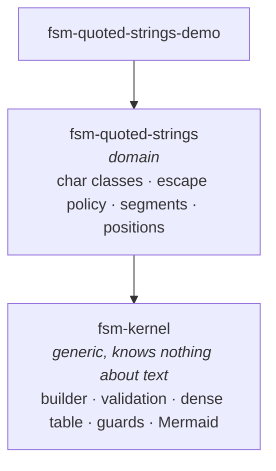
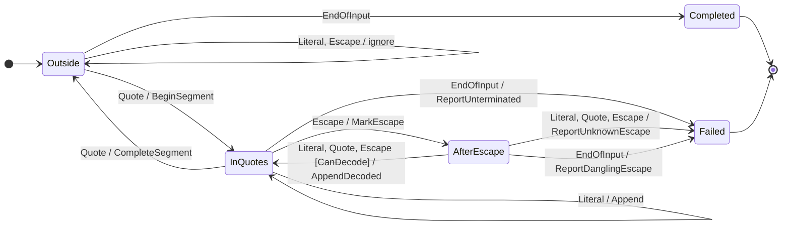

# A declarative, table-driven FSM

A third take on the chapter 5 exercise, alongside `fsm-strings-parse` and `fsm-minimalistic`.
Same problem — pull quoted, escape-aware text out of prose:

```
Ololo "this is \"mega\" text". Nice, innit?   ->   this is "mega" text
```

```csharp
"""Ololo "this is \"mega\" text". Nice, innit?""".FirstQuoted()
```

## What is different

Both earlier versions encode the transition table **imperatively**, inside `if`-chains within a
handler. That works, and it means the table cannot be inspected, validated, drawn, or reused for a
different alphabet — and that a wrong move is discovered at run time, if at all:

```csharp
if (!_currentStateHandler.IsTransitionAllowed(stateHandleResult.NextState))
{
    throw new Exception("Invalid transition");
}
```

Here the table is **declared as data** and checked before a single character is consumed.

| | `fsm-strings-parse` | `fsm-minimalistic` | this |
|---|---|---|---|
| Dispatch | `new XStateHandler()` per character | dictionary lookup per character | direct index into a dense array |
| Allocation per character | one handler + one result | one result | none |
| Bad transition | `throw` at run time | `throw` at run time | cannot be built |
| Missing case | silent | silent | build fails, naming every hole |
| End of input | not modelled | not modelled | a symbol class like any other |
| Unterminated string | silently yields nothing | silently yields nothing | positioned `ScanError` |
| Escape rules | hardcoded | hardcoded | `IEscapeDecoder` strategy |
| Positions | none | none | index, line, column |
| Streaming | whole string only | whole string only | chunks, `TextReader` |
| Diagram | draw it yourself | draw it yourself | generated from the live table |

## Shape



## Three ideas

### 1. The transition function is total, and that is proven at construction

Every reachable, non-terminal state must handle every symbol class, and every cell must end in an
unguarded arm. `Build()` collects **all** violations and throws one aggregate exception:

```
The state machine definition is invalid (4 problems):
  - NoInitialState: No initial state was declared; call Initial(...).
  - MissingTransition: State 'Red' does not handle symbol class 'Stop'.
  - MissingTransition: State 'Green' does not handle symbol class 'Go'.
  - MissingTransition: State 'Green' does not handle symbol class 'Stop'.
```

It also rejects duplicate cells, arms that can never be taken, terminal states with outgoing
transitions, and states unreachable from the initial one.

The payoff is that `Step` has no "unexpected input" branch. That failure mode does not exist at run
time, because a machine exhibiting it cannot be constructed.

### 2. Definition is separate from execution

`StateMachine<...>` is immutable and holds no position, so one instance serves every parse on every
thread. Position lives in a `Cursor` struct. In the scanner this goes further: the table says nothing
about *which* characters quote or escape — that lives in the classifier and the context — so a single
`static readonly` table serves every dialect.

`char` → `CharClass` narrowing is what allows `table[state * classes + class]`: one array lookup and
at most one delegate call per character, nothing allocated.

### 3. Failure is data, and end-of-input is a symbol

`EndOfInput` is a real member of the symbol-class enum, injected once when the caller says the input
is over. So "the text ran out inside a string" is an ordinary declared transition rather than a check
bolted on after the loop:

```csharp
.From(ScanState.InQuotes)
    .On(CharClass.EndOfInput).Do(ScanActions.ReportUnterminated).GoTo(ScanState.Failed)
```

Nothing is thrown. `ScanResult` carries the segments found *and* a `ScanError` positioned at the
construct that started the problem — the unclosed quote, not the end of the file.

## The grammar

This is the entire parsing logic; there is no other place a decision about quotes is made:

```csharp
StateMachine.For<ScanState, CharClass, char, ScanContext>()
    .Initial(ScanState.Outside)
    .Terminal(ScanState.Completed, ScanState.Failed)

    .From(ScanState.Outside)
        .On(CharClass.Quote).Do(ScanActions.BeginSegment).GoTo(ScanState.InQuotes)
        .On(CharClass.EndOfInput).GoTo(ScanState.Completed)
        .OnRemaining().Ignore().Stay()

    .From(ScanState.InQuotes)
        .On(CharClass.Quote).Do(ScanActions.CompleteSegment).GoTo(ScanState.Outside)
        .On(CharClass.Escape).Do(ScanActions.MarkEscape).GoTo(ScanState.AfterEscape)
        .On(CharClass.Literal).Do(ScanActions.Append).Stay()
        .On(CharClass.EndOfInput).Do(ScanActions.ReportUnterminated).GoTo(ScanState.Failed)

    .From(ScanState.AfterEscape)
        .On(CharClass.EndOfInput).Do(ScanActions.ReportDanglingEscape).GoTo(ScanState.Failed)
        .OnRemaining()
            .When(ScanGuards.CanDecode).Do(ScanActions.AppendDecoded).GoTo(ScanState.InQuotes)
            .Otherwise().Do(ScanActions.ReportUnknownEscape).GoTo(ScanState.Failed)

    .Build();
```

Note what is *not* there: the `FINISHED_STRING` state both earlier versions carry. Closing a quote is
something the machine **does** (`CompleteSegment`), not somewhere it **is**. Modelling it as a state
costs a spurious extra step that consumes the following character for nothing.

The guard on the last row is what keeps dialect policy inside the declared table: whether `\q` is the
letter `q` or an error is one question, asked once, in the place the reader is already looking.

## The diagram, generated

`QuotedStringScanner.MachineDiagram` renders the array the engine actually steps through, so it
cannot drift from the code. Arms differing only by symbol class are merged.



Edge labels are the method names of the effects and guards, so they are never stale either.

## Using it

```csharp
// One-liner.
var text = """Ololo "this is \"mega\" text". Nice, innit?""".FirstQuoted();

// Full result, with positions and errors.
var result = QuotedStringScanner.Default.Scan(input);
foreach (var segment in result.Segments)
{
    Console.WriteLine($"{segment.Value} at {segment.Start}");
}
if (result.Error is { } error)
{
    Console.WriteLine($"{error.Kind}: {error.Message}");
}

// A different dialect: \n really means a newline, \q is rejected.
new QuotedStringScanner(QuoteSyntax.CStyle).Scan(input);

// Input that arrives in pieces; boundaries are irrelevant to a state machine.
var session = QuotedStringScanner.Default.BeginSession();
session.Feed(firstChunk);
session.Feed(secondChunk);
var streamed = session.Complete();

// Or straight off a stream, through a pooled buffer.
QuotedStringScanner.Default.Scan(File.OpenText(path));
```

## Trade-offs taken knowingly

- **Four generic parameters** on the kernel is ergonomically heavy. The alternative — baking `char`
  into it — would destroy the reuse that justifies a separate assembly. Softened with a
  `StateMachine.For<...>()` factory.
- **States and symbol classes must be `int` enums numbered `0..N-1`.** That constraint is what buys
  the dense table; it is checked at `Build()` and reported like any other diagnostic instead of
  mis-indexing silently.
- **Guards** add machinery over a flat table. They earn it: without them the "unknown escape
  sequence" decision leaks out of the declaration and into an effect.
- **Totality is validated, not type-enforced.** A cell can be left without its fallback and still
  compile. Encoding that in the type system would make the fluent API rigid; `Build()` catches it
  before the machine ever runs, and there is a test for each way of getting it wrong.
- `\r\n` counts as one line break at the `\n`; a lone `\r` advances the column.

## Layout

```
src/fsm-kernel/                 generic engine, no notion of text
src/fsm-quoted-strings/         the scanner, built on the kernel
src/fsm-quoted-strings-demo/    dotnet run to see it work
tests/fsm-kernel.UnitTests/         19 tests
tests/fsm-quoted-strings.UnitTests/ 35 tests
```

The two earlier projects and their tests are untouched and still build and pass alongside these.
